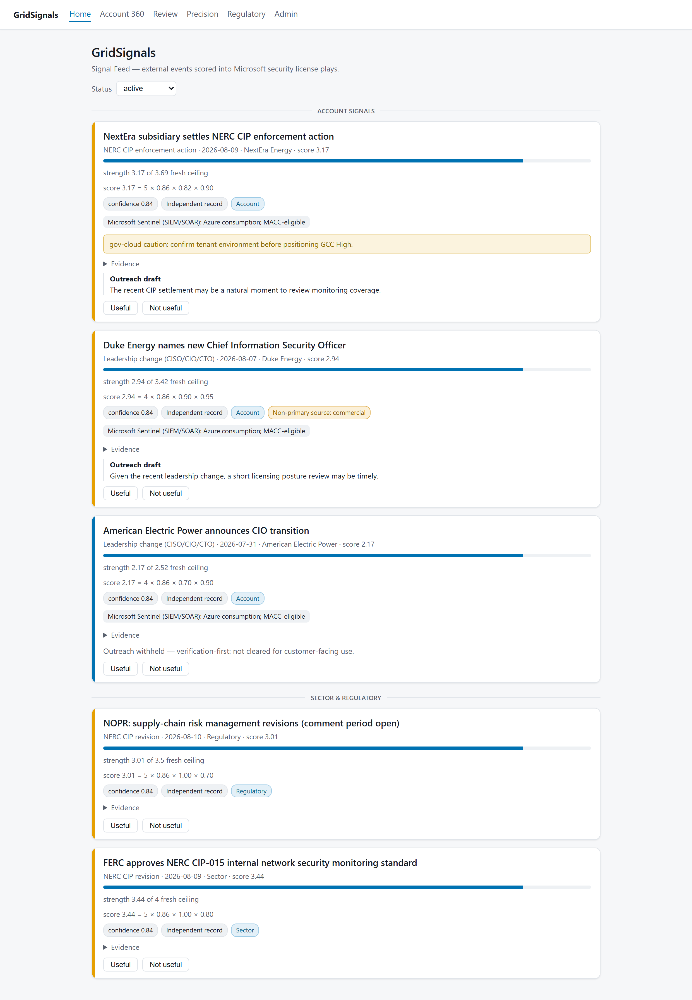
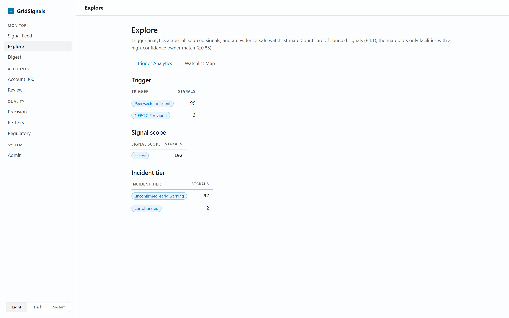
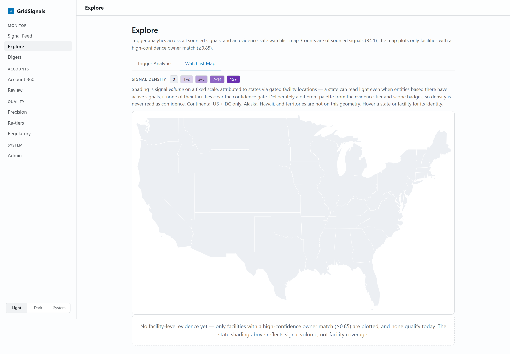
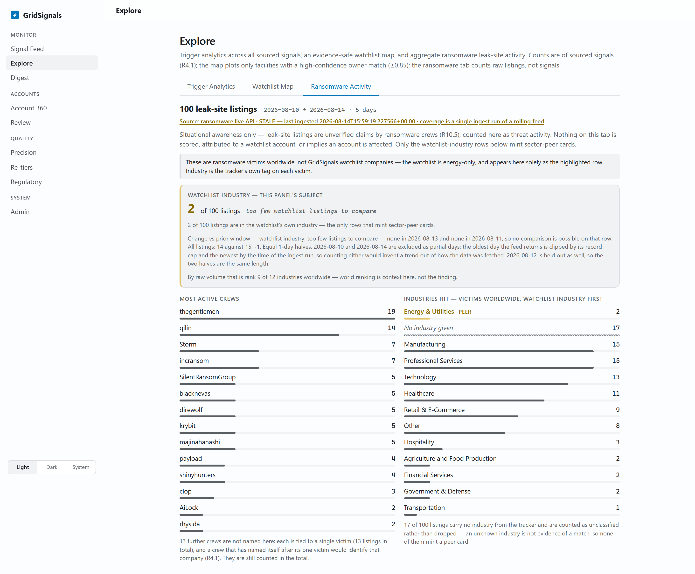
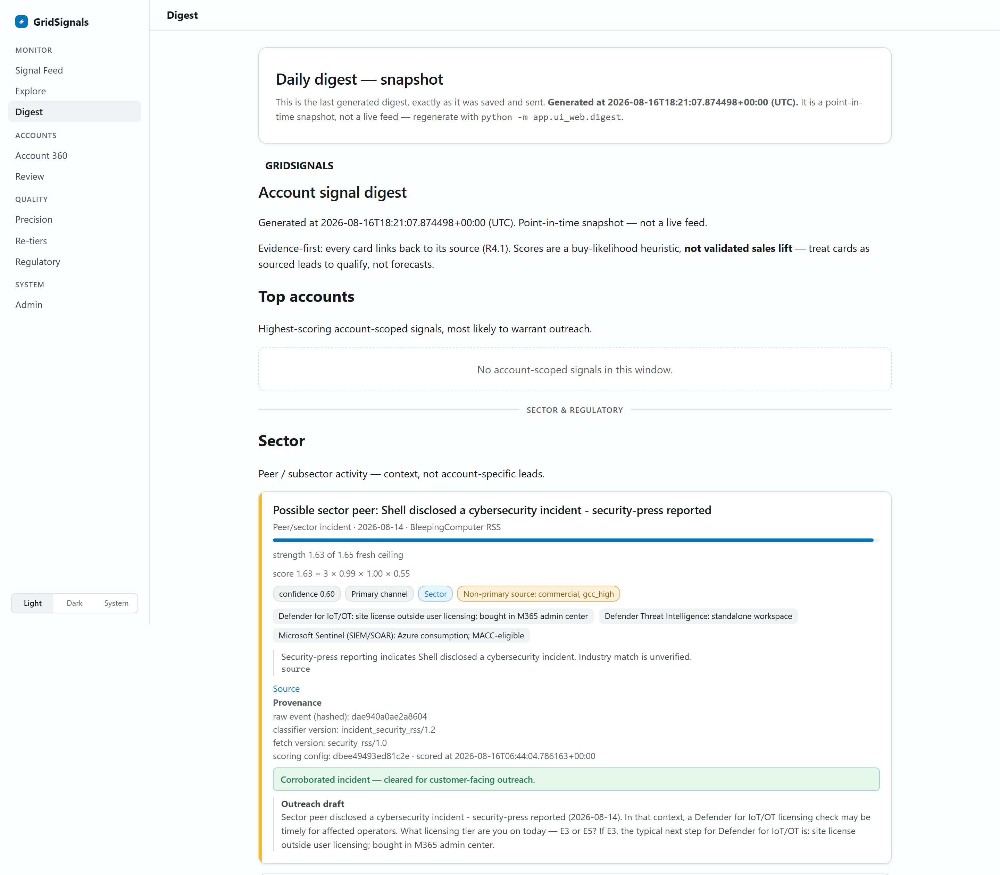
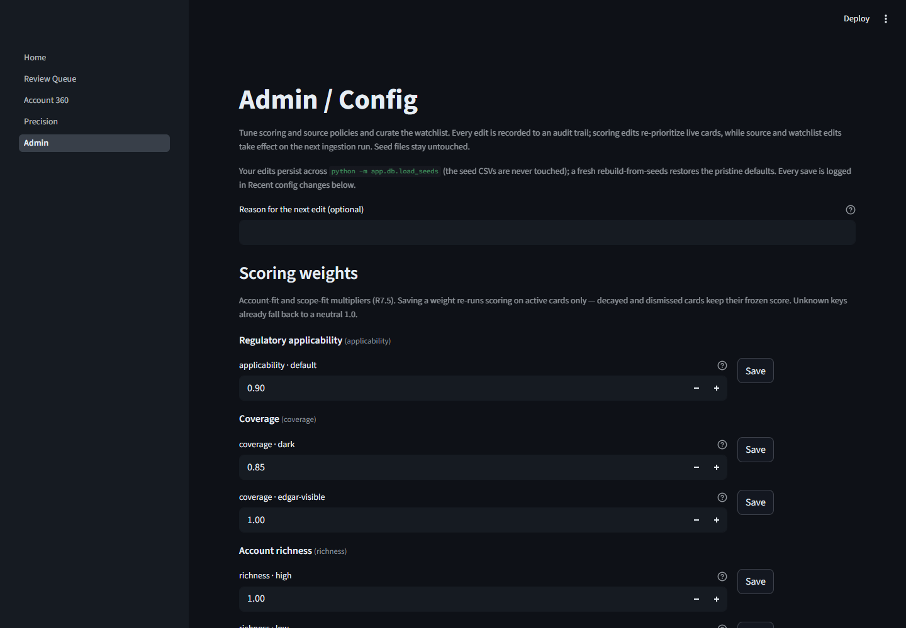
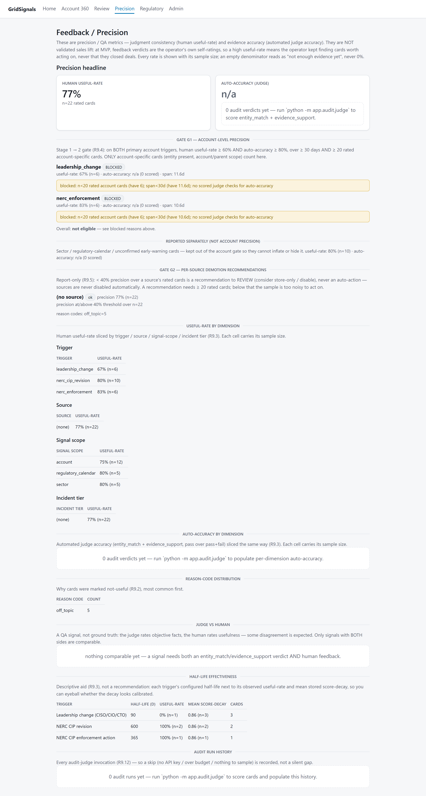
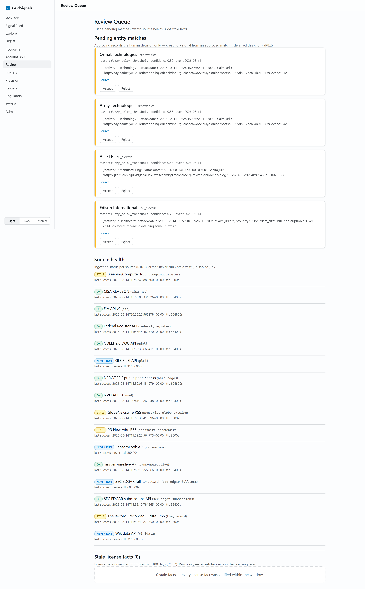
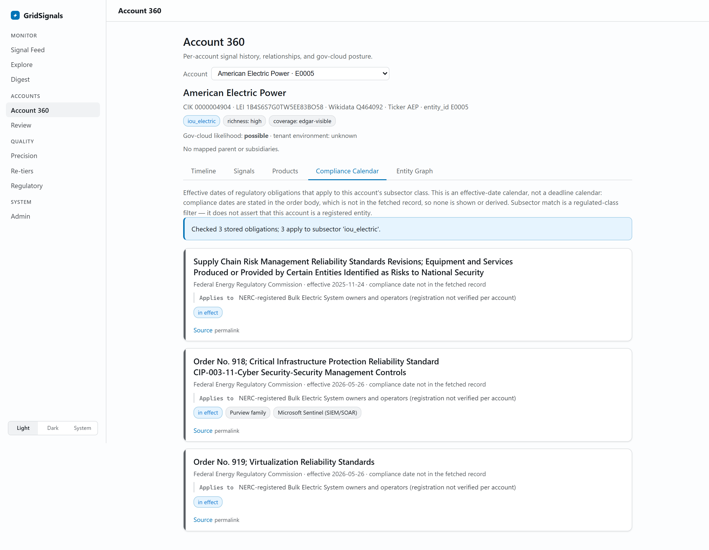
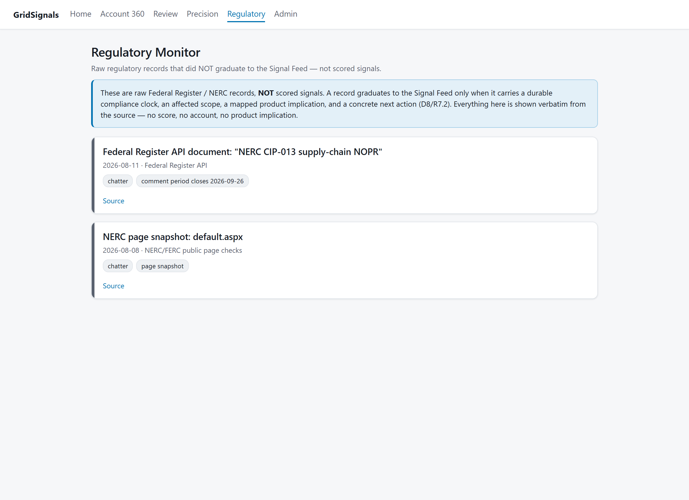

# GridSignals

Turns the public record around US energy companies into scored, sourced signal cards — compliance clocks (NERC CIP / FERC / TSA) and sector incident pressure, each mapped to a Microsoft security product with a license path and a draft outreach opener. Account-specific cards are a separate, evidence-gated tier; see [Coverage](#coverage).

Stack: Python · SQLite · a FastAPI + HTMX + Tailwind web UI. All data sources are free and read-only.

> **Status: pipeline working end-to-end; live output is sector and regulatory scope.** The database schema, seed loader, entity resolution, the core ingestion layer (EDGAR, Federal Register, press-wire RSS, NERC pages, CISA KEV), normalized license facts, rule-based classification & scoring, and immutable license-play snapshots with gov-cloud gating are implemented and verified against the stored 12-month backfill. The **FastAPI + HTMX + Tailwind UI** (signal feed, explore, digest, account 360, review queue, feedback/precision, recent re-tiers, regulatory monitor, admin/config) is implemented as a rule-based MVP, now with a **feedback loop, a capped Claude API accuracy-audit judge, precision reporting, and an audited Admin config surface for tuning weights, half-lives, and source policies plus managing the watchlist (add / edit / soft-disable entities, alias & collision editing)**. It replaced the original Streamlit UI at the R8.9 port cutover — see [Roadmap](#roadmap).

## How it works

GridSignals ingests a broad set of free, public signals about US energy companies and turns the highest-signal events into scored, sourced cards. Each card maps an event to relevant Microsoft security products, resolves a licensing path, and drafts an outreach opener. Every claim carries a source link and an evidence-quality tag; nothing surfaces unsourced.

The signal that carries reliably from free public sources is **timing, not targeting**. A NERC CIP revision or a FERC/TSA rule with a stated compliance date tells a seller *when* a class of regulated entities has to have a control in place, and which control. Sector incident pressure — a named energy-industry victim on a leak site, a confirmed intrusion in the security press — tells them what the same class is currently exposed to. Both are durable, well-sourced, and legible without naming a company that has not disclosed anything. That is what the product produces every week.

Wider sources — known-exploited vulnerabilities, global news, facility data — are **ingested and stored** without classification, so later stages classify against history instead of starting cold.

Design principles:

- **Read-only, free sources only.** No paid feeds, no ToS-restricted scraping, no ML.
- **Evidence over noise.** Confidence gating and an automated accuracy audit rather than a firehose; low-volume, high-signal triggers are classified first.
- **Config as data.** Products, triggers, mappings, watchlist, and the license matrix live as CSV seeded into SQLite — editable without code changes.
- **An empty surface is a boundary, not a bug.** Where the public record does not support a claim, the product says so and shows the measurement, rather than filling the space with a weaker inference.

## Coverage

GridSignals produces cards at two scopes. They are held to different evidence bars, and only one of them clears from free sources today.

### Sector & regulatory — live

Compliance clocks and sector threat pressure. Cards name the affected entity *class*, an effective or compliance date, the mapped product, and a next action. They are never attributed to a company that has not disclosed anything, so they carry no attribution risk. Sources: Federal Register (FERC, TSA), NERC standards pages, ransomware.live, and security-press reporting (The Record, BleepingComputer).

This is the tier the weekly output comes from. On the project's own 12-month corpus it currently holds 7 active cards — 3 NERC-CIP regulatory revisions and 4 sector-peer incident cards.

### Account-specific — gated

Account-scoped cards are built and armed: entity resolution with collision guards and a review queue, `own_incident` / `leadership_change` classifiers, account-fit scoring, license-play snapshots, and the Account 360 page. **They have never fired.** Zero signals in the store have ever carried an `entity_id`.

That is a property of the free public record, not of the classifiers. Measured over the stored 12-month backfill across 171 watchlist entities:

| Account trigger | Input it needs | What the corpus holds |
|---|---|---|
| `own_incident` | SEC 8-K **Item 1.05** (material cybersecurity incident) | **0 filings** across 1,886 EDGAR submissions |
| `leadership_change` | SEC 8-K **Item 5.02** filing documents | 45 of 242 documents fetched; **0** named a security executive |
| `nerc_enforcement` | NERC enforcement dockets naming a violated CIP standard | 18 notices ingested; **2** name a watchlist entity, **0** name a CIP standard |

All three empties are structural. Item 1.05 runs roughly two filings a week across ~5,000 SEC issuers nationally, so the energy slice is a couple per *year* — not per week. Item 5.02 is scoped to Section 16 officers, and a CISO is not one; a company can hire its entire security leadership without a filing. No amount of parser quality changes either number.

The enforcement docket is now ingested rather than hypothetical, and the measurement is what settles it: of 18 notices spanning 2025-01 → 2026-07, 14 are monthly aggregate "Spreadsheet Notice of Penalty" filings naming no entity and 4 are named-entity notices covering 5 companies — of which two are on the watchlist. None names a violated CIP standard in its title, and the trigger requires one, because a play with no mapped product is a card with nothing to say. Fetching the notice body to recover the standard is the same bet as the Item 5.02 document fetch above, which returned zero; and NERC does not post redacted CIP notices publicly at all, so the CIP subset is not measurable from the public docket by design.

So the account tier stays gated rather than shipped-and-empty. The feed keeps a labeled account/sector divider with the account half blank and the reason stated, the digest ranks sector cards, and account precision is reported separately so a zero denominator reads "not enough evidence yet" instead of 0%.

**Entry criteria — any one of these lifts the gate, with no code change except where noted:**

1. **A watchlist entity files an 8-K Item 1.05.** The classifier runs over every EDGAR backfill and mints a confirmed account card on the first one.
2. **A watchlist company's own press wire discloses an incident, or announces a security executive.** The company-statement and leadership grammars are implemented and recall-latent — they fire when such a release lands.
3. **ransomware.live names a watchlist company.** Resolves to an account card at the unconfirmed early-warning tier, operator-only, outreach suppressed until re-tiered.
4. **A NERC enforcement-docket fetcher is built.** NP-series notices of penalty name the registered entity and carry real volume; this is the one unbuilt path with a plausible account-level rate, and the only item on this list that is engineering rather than waiting.

Until then, the honest claim is the one the product makes: sector and regulatory intelligence, weekly; account intelligence, opportunistically and never padded.

## Screenshots

The FastAPI + HTMX interface in its default light theme (a dark and a system theme ship alongside it). These are shot against the project's **own local database of real events** pulled from the free public sources listed below — not a curated sample — so they include the empty and low-volume states the pipeline actually produces today. That is the point of the trust surfaces: scores shown with their evidence and sample sizes, prices never surfaced, outreach gated, and every empty panel saying *why* it is empty rather than reading as broken.

**Signal Feed** — scored, sourced cards with the score decomposition, evidence/scope badges, license-play chips, and a customer-facing-gated outreach draft. Account-scoped cards sit above a labeled sector/regulatory divider — here the account half is empty, for the measured reason in [Coverage](#coverage), and the feed says so instead of padding.



**Explore** — trigger, scope, and incident-tier analytics over all sourced signals, an evidence-safe watchlist map, and aggregate ransomware leak-site activity. The map plots a facility only with a stored owner match at ≥0.85 confidence; with nothing over that bar it shades signal volume by state and says so, rather than inferring points.





The Ransomware Activity tab counts raw leak-site listings rather than signals, over the window the stored data actually spans (ransomware.live is a rolling recent feed, so that window is days, not months). These are ransomware victims worldwide — not watchlist companies, which are energy-only. The panel **leads with the watchlist's own industry row** and its change against the prior window; world volume ranking sits underneath as context, since "who is busiest worldwide" is not the question the tab exists to answer. Only an energy-industry victim supports the "sector peer" claim a card would make, so the other listings never mint a card, and this tab is where they stay visible as threat context: unscored, attributed to no account, credited to the source.

The prior-window comparison is deliberately conservative, because a trend is the easiest thing on this page to manufacture by accident. Both ends of the covered window are partial days — the oldest is clipped by the feed's fixed record cap, the newest by the clock at ingest time — so both are excluded from both halves (along with the middle day when the interior is odd, to keep the halves equal-length). Too short a corpus reports *no comparable prior window* rather than a number, and a watchlist row absent from both halves says *too few listings to compare* rather than "no change", which would read as a measured result off an empty denominator. The byline states whether coverage came from one ingest run or accumulated across several.

A crew is named only if it is tied to two or more distinct victims. One victim can appear as several listings when the tracker revises a record, so counting listings would let a crew that named itself after its single victim identify that company. Withheld crews are still counted in the total, and the page says how many it is holding back.



**Digest** — the in-app mirror of the standalone daily HTML digest the pipeline writes to disk for a human to send, shown as a timestamped point-in-time snapshot and framed as a buy-likelihood heuristic, not validated sales lift.



**Admin / Config** — operator tuning for scoring weights and decay half-lives, ordered by measured effect: the knobs an active card actually consults are open by default, the rest collapse behind a labeled "inert on the current corpus" tier (still editable, and they promote themselves as soon as a signal that uses them lands). A source registry (enable / disable, add an operator source, guarded remove of an operator-added one); a watchlist entity manager (add / edit / soft-disable, alias & collision-term editing, reset-to-seed / guarded remove); and an in-place license-fact editor (edit the editable columns, add a fact — no delete, since cards read frozen snapshots) alongside the staleness list. Every edit lands in a provenance trail. Edits persist across a seed reload; a fresh rebuild restores the pristine defaults.



**Feedback / Precision** — human useful-rate and automated-judge accuracy by trigger/source/scope/tier, with every rate shown alongside its sample size. An empty denominator reads "not enough evidence yet" and names the command that would populate it — never 0%.



<details><summary>More: Review Queue, Account 360 &amp; Regulatory Monitor</summary>

**Review Queue / Triage** — pending entity matches with accept/reject, per-source health that distinguishes error / never-run / stale / disabled, and stale license facts.



**Account 360** — per-account identifiers, gov-cloud posture, and five tabs: Timeline, Signals, Products, Compliance Calendar and Entity Graph. Shown on the Compliance Calendar, which is the tab with sourced rows today — obligations are matched by *subsector class*, never keyed to the account, and the panel says so rather than implying this company is a registered entity. It is an **effective-date** calendar: compliance dates live in the order body, which is not in the fetched record, so none is shown or derived. The coverage line ("checked 3 stored obligations; 3 apply to subsector `iou_electric`") is deliberately falsifiable.

The other tabs are empty for most accounts, each stating its own reason: Products reads only the account's *own* signals' plays, and no signal has ever carried an `entity_id`, so sector-scoped plays are deliberately not attributed here; Entity Graph shows only *sourced* relationship edges, so the seeded parent hint never appears in it.



**Regulatory Monitor** — non-graduated regulatory chatter shown verbatim from the source's own record, with no score, account, or product implication.



</details>

## Data sources

The MVP target source set — all free and accessed read-only (GET / RSS / JSON / bulk download). The classified sources and the store-only backfill tier are ingested today; see [Roadmap](#roadmap).

| Source | Role |
|---|---|
| SEC EDGAR — 8-K / 10-K filings + submissions API | Classified — leadership + regulatory |
| SEC EDGAR full-text search | Stored — filing *bodies* (incl. exhibits) mentioning a watchlist entity (later-stage classification) |
| Federal Register API (FERC, TSA) | Classified — regulatory |
| Press-wire RSS (PR Newswire, GlobeNewswire) | Classified — leadership + company-statement incidents |
| NERC / FERC public pages | Classified — regulatory |
| NERC enforcement docket (NP-series) + NERC events calendar | Stored — not classified; see [Coverage](#coverage) for the measured reason |
| GDELT global news | Stored for backfill (later-stage classification) |
| CISA KEV + NVD | Stored — known-exploited vulnerabilities |
| Ransomware tracker (ransomware.live) | Classified — unconfirmed early-warning incidents (own/peer) |
| Security-press RSS (The Record, BleepingComputer) | Classified — cyber-incident reporting (own/peer, per-source evidence tier) |
| EIA API | Stored — plant geo/capacity for backfill (typed facility projection later) |
| GLEIF + Wikidata | Entity resolution — LEI / QID anchoring |

## What works today

- **Schema + migrations** — the full data model (config + runtime layers, query indexes) managed by a versioned, checksummed migration runner. Applied migrations are tamper-guarded.
- **Connection helper** — SQLite in WAL mode with foreign keys and a busy timeout, matching the single-writer / read-heavy architecture.
- **Seed loader** — idempotent, foreign-key-ordered load of the config data with a per-table row-count report. Safe to re-run; never clobbers runtime-managed state (e.g. a source disabled by the operator, or a scoring weight / decay half-life tuned in Admin, survives a reload — while a fresh rebuild-from-seeds restores the pristine baseline).
- **Source policy registry** — the MVP source inventory seeded with per-source access method, poll interval, ToS status, evidence rank, and rate-limit notes.
- **Entity resolution core** — deterministic CIK/ticker/LEI/alias matching with a fuzzy-name fallback. Known-collision names (e.g. bare "Dominion") never auto-match without corroborating context; ambiguous or low-confidence results go to a review queue instead of firing, and every match decision is logged with its terms and parser version. Covered by an adversarial test fixture set (collisions, subsidiaries, abbreviations, near-twins).
- **Entity enrichment** — an annual-refresh job that anchors the watchlist to external identifiers: Wikidata queried by SEC CIK (deterministic, one batch) for QIDs and LEIs, GLEIF fulltext as fallback accepted only on exact normalized-name match, plus GLEIF parent/child relationship import. Results are generated into reviewable seed CSVs; hand-verified values always win over generated ones.
- **Ingestion layer** — a shared runner (per-source policy checks, TTL skips, run bookkeeping, idempotent native-id/content-hash dedupe, per-source error containment, single-writer lock) plus ten live fetchers. Six feed classified, card-producing sources: SEC EDGAR submissions (8-K/10-K per watchlist CIK), Federal Register (FERC + TSA documents), press-wire RSS (PR Newswire, GlobeNewswire), NERC standards-page snapshots, the ransomware.live victims feed (content-hash dedupe — no native id), and security-press RSS (The Record, BleepingComputer — guid-deduped; headlines classified, full article text never redistributed, link-out only). Four are **store-only backfill** — no classification yet, so later stages classify against history instead of cold: the CISA KEV catalog, GDELT energy-sector news (rolling ~90-day DOC API window), the NVD CVE API (120-day-windowed, paged), and EIA plant capacity records (paged v2, keyed). A 12-month backfill (local — the database is gitignored and rebuildable) is stored and re-runs dedupe to zero.
- **License facts + play candidates** — the hand-verified license matrix normalized into per-segment `license_facts` (commercial + GCC High, with a conservative, lossless mapping of the freeform gov-cloud notes) and one conditional license-play candidate per trigger→product mapping. Rebuild is deterministic from seeded config.
- **Classification & scoring (rule-based MVP)** — a classifier framework (entity resolution with review-queue gating, parent rollup, deterministic signal ids, per-version bookkeeping so re-runs are incremental and rule changes reprocess history) plus six precision-first classifiers: leadership changes (8-K Item 5.02 + press-wire appointment grammar, security-relevant titles only), regulatory actions (Federal Register FERC/TSA rules with a required compliance-clock anchor; NERC standards-page diffs), and cyber incidents from four sources — SEC 8-K **Item 1.05** (the SEC's dedicated Material Cybersecurity Incidents item over the stored EDGAR backfill: one filing mints a **confirmed** `own_incident` card for the filer and a sector-wide `peer_incident` card, which carries no organization because an 8-K names only its own filer), the **ransomware.live** leak-site tracker (each victim resolved by name → a watchlist match mints an `own_incident` account card, an off-list victim a `peer_incident` sector card that names the organization while citing only the tracker's bare domain, both **unconfirmed early-warning** under the R10.5 evidence tiers; ambiguous/collision names go to the review queue and never auto-fire), and **company statements** (a watchlist company's own press-wire release disclosing a cyber incident → a **confirmed** `own_incident` card, resolved by name with the same review-queue gating; a strict verb+cyber-phrase grammar excludes fiduciary-duty "breach" notices and vendor threat reports — recall-latent until real breach releases land in the wire backfill), and **security-press reporting** (The Record + BleepingComputer items: a strict disclosure grammar resolves the reported company by name → a watchlist match mints a **corroborated** `own_incident` account card, an off-list company a **corroborated** `peer_incident` sector card naming that company under a hedged "Possible sector peer" label; BleepingComputer leak-adjacent attacker/leak-site *claims* down-tier to an **unconfirmed early-warning** peer that stays unnamed, since no company is resolvable from a bare claim, while The Record — non-leak journalism — stays corroborated; ambiguous/collision names go to the review queue and never auto-fire — a general security feed rarely names a watchlist entity, so the peer path is the reliably-firing output). Incident cards carry an evidence tier and gate customer-facing outreach per R7.12 — an unconfirmed early-warning card is operator-only: it leads with a "no confirmation yet" verification-first warning, suppresses the outreach opener, and is kept out of account precision (R8.6). Scores follow `base_strength × 0.5^(age/half-life) × account_fit × scope_fit` with operator-tunable weights seeded from CSV; stale signals decay automatically. Every signal carries ranked evidence rows — nothing surfaces unsourced. On the live corpus the regulatory and peer paths are the ones minting cards; the account-scoped paths are implemented and armed but input-starved, with the counts in [Coverage](#coverage).
- **License-play snapshots + gov-cloud gating (rule-based MVP)** — each signal gets immutable play snapshots pinning the licensing evidence basis (fact ids, display text, outreach-safe text) at generation time, so old cards stay explainable after licensing data changes. Outreach text never states non-primary prices, never asserts the account's current tier, and stays sector-phrased for sector-wide events. Security Copilot plays are suppressed for known/likely US government cloud tenants.
- **FastAPI + HTMX + Tailwind UI (rule-based MVP, nine pages)** — a multi-page app behind a grouped sidebar shell (Monitor / Accounts / Quality / System) with a three-state theme toggle: a light default, a dark theme, and a "system" setting that follows the OS, the choice persisted locally. A **Signal Feed** of custom HTML/CSS cards (severity badge, score ring, decay bar, the R7.3 score decomposition `2.34 = 5 x 0.85 x 1.00 x 0.55`, evidence/scope/coverage badges, product and license-play chips, expandable sourced evidence, an outreach draft shown only when customer-facing-allowed, and useful/not-useful feedback with reason codes), scope-separated so account cards sit above a labeled sector/regulatory divider (R7.2), with keyset pagination and a status filter. Every card is addressable at a stable permalink (`/card/{key}`) — a read-only single-card view that the Recent Re-tiers trail links back to. A **Review Queue / Triage** page (pending entity matches with accept/reject, per-source health that distinguishes error / never-run / stale / disabled, and a stale-license-fact list). An **Account 360** page (identifiers, relationships, gov-cloud posture, timeline and signal cards). A **Regulatory Monitor** page — a read-only list of *non-graduated* regulatory chatter (raw Federal Register / NERC records with no signal): shown verbatim from the source's own record with no score, account, scope, or product implication, and framed as explicitly not scored signals (R8.4/D8). A **Recent Re-tiers** page — a read-only, central provenance trail of every incident re-tier across all cards (who changed which card's tier, and whether any card was cleared for customer-facing outreach per R7.12), the aggregate companion to the per-card tier editor and its history. A **Digest** page — the in-app mirror of a standalone daily HTML digest the pipeline writes to disk (`python -m app.ui_web.digest`) for a human to send: top account-scoped signals by score above a labeled sector/regulatory divider, evidence-first (every card links back to its source, R4.1) and framed as a buy-likelihood heuristic, not validated sales lift, shown as a point-in-time snapshot with its generation timestamp (R8.8/R10.2). The **Feedback / Precision** and **Admin / Config** pages are described in their own entries below. The app is read-mostly — it writes only feedback, review dispositions, human match decisions, and explicitly-audited Admin config edits (R8.7, below); cards read immutable snapshots, never live facts (R7.6), and non-primary prices never reach the UI (R4.3). Score components are persisted by `rescore()` and a `supersede` pass flips a superseded proposal (docket-overlap only) out of the default feed. Empty and sparse surfaces read "low-volume by design," never "broken" (R6.6).
- **Feedback loop + accuracy audit + precision reporting (rule-based MVP + capped Claude judge)** — cards capture useful/not-useful feedback with reason codes; a separate **audit judge** samples recent signals and asks a capped Claude model (default Haiku 4.5, called over `urllib` — no SDK) four *objective* checks per card (entity match, classification, evidence support, license-play support). The judge never rates usefulness and never changes weights, mappings, or facts; every verdict is versioned (model id + prompt version + parser version). It reads `ANTHROPIC_API_KEY` from the environment and enforces a per-run budget ceiling — with no key or an exhausted budget it records a skipped run and exits cleanly, never blocking ingestion or fabricating confidence. A **golden set** gates prompt/model changes, and a **Feedback / Precision** page reports human useful-rate and auto-accuracy by trigger/source/scope/tier, reason-code distribution, judge-vs-human disagreement, half-life effectiveness, and the G1/G2 gate status — every rate shown with its sample size, and labeled QA precision, explicitly **not** validated sales lift.
- **Admin / Config (R8.7)** — an operator page that makes scoring and the watchlist tunable without code changes: **weight** and per-trigger **decay half-life** editors partitioned by *measured* blast radius — the page replays the scorer's own key selection over active signals, so the handful of knobs that reach a live card sit open and the inert majority collapses behind a labeled drawer, with the split recomputed on every render rather than hand-curated. A tier saves as one batch under a single lock, with its reason attached to that save, and each changed value still writes its own provenance row (a save re-runs scoring on active cards only, so decayed and dismissed cards keep their frozen score decomposition). **Source enable/disable** with the report-only Gate G2 demotion recommendation shown alongside, and read-only `verified_date` staleness flags (>180 days). A **watchlist entity manager** adds, edits, and **soft-disables** accounts, edits their aliases and collision terms, and **resets** a seeded entity to its seed values or **removes** an operator-added one — the remove is FK-guarded, blocked with a legible message while any signal still references the entity. Soft-disabling an entity stops *future* resolution and ingestion for it (the resolver, EDGAR fetch, and account selector all skip inactive entities) while its existing cards keep their frozen scores. Every edit is recorded to an append-only `config_audit` provenance trail (R3.3); the hand-verified seed CSVs are never touched, so operator tuning and curation survive a `load_seeds` reload while a fresh rebuild-from-seeds still returns the pristine baseline. An **incident evidence-tier editor** — on each incident card, not this page — lets the operator confirm or re-tier a card across the R10.5 tiers (confirmed / corroborated / unconfirmed early-warning); every re-tier re-derives the R7.12 customer-facing outreach gate from the new tier and appends to an immutable `incident_tier_edits` trail (UPDATE-in-place under the single-writer lock, so snapshots that reference the signal are never orphaned). Promoting a card to a customer-facing tier — the one move that clears it for outreach — requires a recorded justification (R4.1 provenance), and a cleared card carries a persistent "cleared for customer-facing outreach" marker so the tier state is legible at rest, mirroring the unconfirmed card's withheld notice.

## Getting started

Requires Python 3.11+. The pipeline and data layer are standard-library only; UI packages live in `requirements.txt`: **FastAPI**, **Uvicorn**, **Jinja2**, **python-multipart**, and **httpx** for the `app/ui_web/` web UI and its tests.

```bash
pip install -r requirements.txt   # UI packages only; pipeline/data code stays stdlib
python -m app.db.load_seeds       # create data/gridsignals.db + config tables
python -m app.backup              # export a portable DB copy -> data/backups/gridsignals-YYYY-MM-DD.db (suffix if present)
python -m app.licensing           # normalize license facts + play candidates
python -m unittest discover -s tests   # hermetic tests, no network
uvicorn app.ui_web.app:app --reload    # launch the web UI: Signal Feed / Review Queue / Account 360 / Precision / Re-tiers / Regulatory / Digest / Admin / Explore
```

This creates `data/gridsignals.db` (gitignored) and populates the config layer from `seeds/`. All commands are idempotent and safe to re-run. A fresh clone has no event data yet, so the feed reads "low-volume by design" until you build a backfill (below).

A fresh clone starts with **no event data** — the raw-event backfill referenced below lives in the (gitignored) local database, not the repo. To build your own and see real signals end-to-end, run the pipeline (live fetches; free, read-only, polite):

```bash
python -m app.ingest.edgar                          # SEC EDGAR submissions
python -m app.ingest.edgar_fulltext                 # SEC EDGAR filing bodies/exhibits (store-only)
python -m app.ingest.federal_register               # FERC + TSA documents
python -m app.ingest.presswire --source prnewswire  # press-wire RSS
python -m app.ingest.presswire --source globenewswire
python -m app.ingest.nerc_pages                     # NERC page snapshots
python -m app.ingest.cisa_kev                       # CISA KEV (store-only)

python -m app.ingest.gdelt                          # GDELT energy news (store-only, ~90d window)
python -m app.ingest.nvd --window-days 14           # NVD CVE API (store-only; NVD_API_KEY optional).
                                                    #   Pages oldest-first, so bound it: a stopped
                                                    #   unbounded run leaves the newest CVEs unfetched.
python -m app.ingest.ransomware                     # ransomware.live victims (raw feed)
python -m app.ingest.eia --limit 5000               # EIA plant capacity (store-only; needs EIA_API_KEY).
                                                    #   --limit is required in practice: the route is the
                                                    #   whole US generator fleet, monthly, paged 5000 at a
                                                    #   time, and runs for hours unbounded.
python -m app.ingest.security_rss --source therecord        # The Record RSS (raw feed)
python -m app.ingest.security_rss --source bleepingcomputer # BleepingComputer RSS (raw feed)

python -m app.classify.leadership                   # offline from here on
python -m app.classify.regulatory
python -m app.classify.incident                     # SEC 8-K Item 1.05 incidents
python -m app.classify.ransomware                    # ransomware.live early-warning incidents
python -m app.classify.company_statement             # company-own breach press releases
python -m app.classify.security_rss                  # security-press incidents (The Record + BleepingComputer)
python -m app.scoring
python -m app.plays

python -m app.audit.judge                           # accuracy audit (needs ANTHROPIC_API_KEY;
                                                    #   no key / over budget -> records a skipped run, exits 0)
python -m app.audit.goldens                         # golden-set regression check (needs a key)
```

Signals land in the `signals` table with ranked evidence in `signal_evidence`; each signal's license plays are pinned in `license_play_snapshots`. View the UI with `uvicorn app.ui_web.app:app --reload`.

## Run it hosted (Azure App Service)

To put GridSignals on a URL instead of a laptop, `deploy/azure-deploy.ps1` builds
a container image *inside Azure* (no local Docker) and provisions App Service for
Containers:

```powershell
az login
./deploy/azure-deploy.ps1
```

The image build itself is **fetch-free** — no network calls, no baked-in signals.
Because the feed is empty without event data, the container's entrypoint seeds the
schema and config synchronously, then **runs the ingest pipeline in the background
on first start**, so the app serves immediately and the feed's 120-second
auto-refresh surfaces signals as they land. A durable volume that already holds
signals skips the ingest. It serves
public-event signals with no auth by default; see
[deploy/README.md](deploy/README.md) for the one-command Entra (Microsoft
sign-in) gate. The `Dockerfile` also runs anywhere Docker does (`docker build -t
gridsignals . && docker run -p 8000:8000 gridsignals`).

## Architecture

```
[ingestion process (writer)] --> SQLite (WAL) <-- [FastAPI + HTMX web app (reader)]
        |                                                |
        +--> audit job (Claude API judge) ---------------+--> audit table
```

Ingestion runs as a separate process from the app — invoked as a CLI, or started in the background by the container entrypoint on first load. (A scheduler to run it on a recurring cadence is not implemented yet; today a repeat run is triggered by hand.) The app never writes signal or event tables; its only writes are feedback, review dispositions, human match decisions, and audited Admin config edits (each takes the same single-writer lock as ingestion). One source failing never blocks a run.

## Roadmap

The MVP classifies regulatory actions, leadership changes, and precision-first cyber-incident slices into cards over a watchlist of 171 US energy companies, while ingesting a broader signal set to build backfill for later stages. "Implemented" means the code path is built and tested; where the free public record does not feed it, the row says so.

| Area | Status |
|---|---|
| SQLite schema + migrations + WAL connection | Implemented |
| Idempotent config/seed loader + source policy registry | Implemented |
| Entity resolution core (deterministic + fuzzy matching, collision guard, review queue, decision log) | Implemented |
| Entity enrichment (GLEIF LEI / Wikidata QID population, parent/child relationships) | Implemented |
| Ingestion runner (dedupe, run bookkeeping, error containment, single-writer lock) | Implemented |
| Ingestion: EDGAR, Federal Register, press-wire RSS, NERC pages, ransomware.live, security-press RSS, CISA KEV, GDELT, NVD, EIA | Implemented |
| Store-only backfill tier (CISA KEV, GDELT news, NVD, EIA plant records) | Implemented |
| License facts + play candidates (normalized from the license matrix) | Implemented |
| Classification & scoring (rule-based; decay half-lives; account fit) | Implemented |
| Stage-2 incident classification — framework evidence-tiering/outreach gating (R10.5/R7.12) + SEC 8-K Item 1.05 own/peer classifier + ransomware.live unconfirmed early-warning classifier with operator-only verification-first UI (R8.6 separate precision) + company-statement press-release classifier + security-press RSS own/peer classifier (per-source tier: The Record corroborated, BleepingComputer leak-adjacent down-tiered to unconfirmed) | Implemented (regulator incident notices would fold into the FERC/NERC enforcement path, which needs the docket fetcher below) |
| License-play snapshots + gov-cloud gating | Implemented |
| FastAPI + HTMX + Tailwind UI (nine pages behind a grouped sidebar; light / dark / system theming; signal feed, explore analytics + watchlist map + ransomware activity, digest, account 360, review queue, precision, recent re-tiers, regulatory, admin) | Implemented (replaced Streamlit at R8.9 cutover) |
| Regulatory Monitor page (read-only view of non-graduated regulatory chatter) | Implemented |
| Feedback loop + automated accuracy audit (Claude judge) + precision reporting | Implemented |
| Admin / Config (weight + half-life tuning, source registry with add/enable/disable/guarded-remove, license-fact editor + add, staleness, config audit trail, watchlist entity manager + alias/collision editor + reset/remove) + incident evidence-tier re-tier editor on incident cards (audited `incident_tier_edits` trail) | Implemented |
| Sector & regulatory scope tier (compliance clocks, peer incidents) | Implemented — the live weekly output |
| Account-specific scope tier (`own_incident`, `leadership_change`, `nerc_enforcement`) | Implemented but **gated** — inputs are data-empty in the free public record; entry criteria in [Coverage](#coverage) |
| NERC enforcement-docket fetcher (NP-series notices of penalty) + NERC events calendar | Implemented — both ingested, neither classified yet; measured ceiling is 2 watchlist entities over 18 months, so this is no longer the account-scope lever it was scoped as (see [Coverage](#coverage)) |

Later stages add combo scoring, GDELT-based classification, and a hiring/macro-trend layer.

## Notes

Single-operator demo/portfolio project — no auth, no multi-tenancy. The only recurring cost is the Claude API accuracy-audit judge, held down by a per-run budget ceiling (config; a measured 5-signal run cost $0.016, so the 20-signal default run is roughly $0.06, against a $0.50 ceiling) and gated on the `ANTHROPIC_API_KEY` env var — with no key it simply skips. There are no paid data sources.
